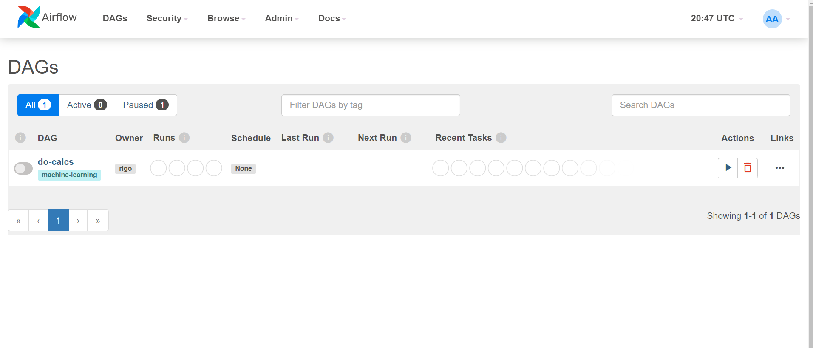
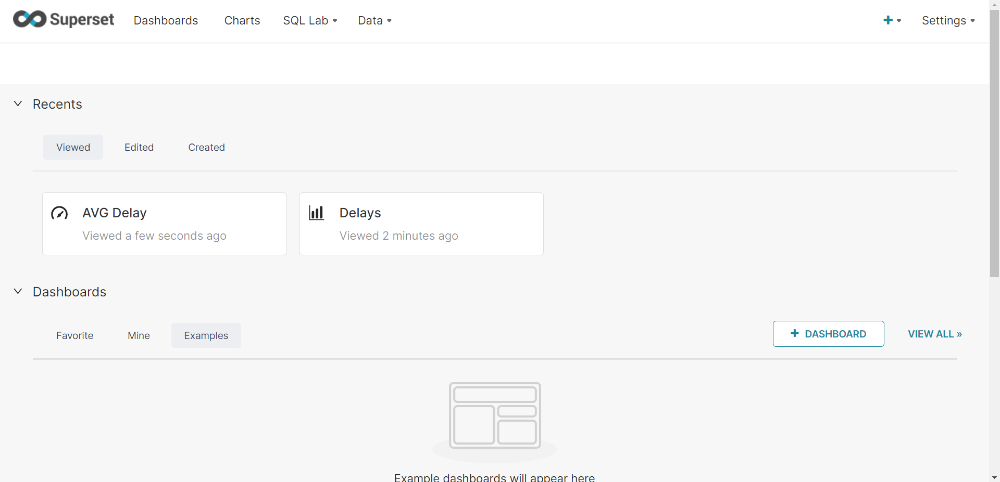

# Airflow ETL With EKS EFS & Sagemaker #
  

## Diagrama de la solución ##

  

[](/images/layout-aws.svg)


## Definición del problema planteado ##


#### Contexto: ####


Acaba de ser contratado como el primer ingeniero de datos de una pequeña empresa de viajes. Su primera tarea para usted fue demostrar el valor y los conocimientos que se pueden generar a partir de las canalizaciones de datos.

Su plan es que una vez que demuestre lo valiosos que pueden ser los datos, comenzarán a invertir en el uso de un proveedor de instancias en la nube. Por ahora, su propia computadora tendrá que hacerlo.

#### Objetivo: ####

Crear un DAG de Airflow que actúe de ETL para extraer extraiga datos estáticos S3 y los cargue en una base de datos de Postgres.

#### Datos a utilizar: ####
  
Para llevar a cabo el desarrollo se utilizará el dataset de demoras y cancelaciones de viajes aéreos de Kaggle que será hosteado en un bucket en S3. Lo primero será obtener los datos siguiendo estos pasos:

* Instalar el cliente de Kaggle: pip install kaggle.

* Instalar el cliente de aws siguiendo estas [instrucciones](https://docs.aws.amazon.com/cli/latest/userguide/getting-started-install.html) acorde a su sistema operativo.

* Instalar el cliente de aws eksctl siguiendo estas [instrucciones](https://docs.aws.amazon.com/eks/latest/userguide/eksctl.html)

* Configurar las credenciales siguiendo estas [instrucciones](https://github.com/Kaggle/kaggle-api#api-credentials).

* Bajar datos de Kaggle:

	```
	cd /path/to/dataset/
	mkdir -p minio/data/flights-bucket
	```

Download zipped dataset from kaggle

	```
	kaggle datasets download -d yuanyuwendymu/airline-delay-and-cancellation-data-2009-2018
	```

Unzip files

	```
	unzip airline-delay-and-cancellation-data-2009-2018.zip -d raw/
	```


Remove zipped data to save space

	``` 
	aws s3 sync raw/ s3://ml-dataset-raw-s3/raw/
	```

Remove zipped data to save space [optional]

	```
	rm airline-delay-and-cancellation-data-2009-2018.zip
	```

En este punto al correr el comando el siguiente comando debería aparecer un archivo CSV por año en el directorio de s3:

	```
	aws s3 sync raw/ s3://ml-dataset-raw-s3/raw/
	```

<br><br>

## Desarrollo: ##

1. Se configuró Airflow en AWS. Realizando el deploy dentro de un contenedor de Docker en una virtual machine EC2.

2. Se creó una instancia RDS con Postgres. Esta instancia se utilizó como DB en los puntos siguientes.

3. Se desarrolló un DAG de Airflow con schedule anual:

	○ Calcula el promedio del tiempo de demora de salida (columna DEP_DELAY) por aeropuerto de salida (columna ORIGIN) y día.

	○ Utiliza un algoritmo de detección de anomalías para identificar por cada aeropuerto si hay dias con demoras fuera de lo normal.

	○ Utiliza los datos del punto anterior para producir un gráfico desde Python, por cada aeropuerto.

	○ Carga la data sumarizada junto con un indicador para la fila correspondiente de cada día para indicar si para ese día en un aeropuerto particular las demoras estuvieron fuera de lo esperable.


4. Se desarrolló una visualización de los datos cargados, para ello se utilizó Superset en otro contenedor de Docker. Se incluye el archivo Docker Compose para levantar la utilidad, junto con un archivo de configuracion con variables de entorno.


Notas:

- El DAG funciona para cualquiera de los años 2009 a 2018 incluidos en el dataset. Se tiene en cuenta que si se corre dos veces para el mismo año podría haber una duplicación de datos y se resolvió.

  
  

## Para levantar la infraestructura ##

  

1. Crear una virtual machine (al menos **t3.large**, y **30gb** de almacenamiento) con Ubuntu 20.04 de SO.

	a. (Opcional) Setar una **elastic IP** para poder acceder de manera mas sencilla.


2. Crear una instancia de **Postgres RDS**, con al menos 5gb de espacio.

  

3. Conectarse via SSH a la virtual machine para configurar el entorno.


	### Docker ###

	a. Instalar Docker	  

	```
	sudo apt-get update
	sudo apt-get install docker.io
	```

	b. Instalar Docker Compose

	```
	sudo apt-get update
	sudo apt-get install docker.io
	```

	### Airflow ###

	c. Clonar la repo en alguna carpeta dentro de la VM
	
	d. Dentro del directorio ```./airflow/dags/db/``` modificar el archivo **Pg.py** y cambiar los credenciales conectar a la db (RDS).

	e. Instalar Python junto con el modulo de Kaggle para descargar los dataset

	```
	apt-get updates
	apt-get install python3-pip
	pip install kaggle
	```

	y nos debemos autenticar para poder descargar el dataset con:

	```
	export KAGGLE_USERNAME=datadinosaur
	export KAGGLE_KEY=xxxxxxxxxxxxxx
	```

    f. Ingresar a directorio ```./airflow/dags/BLL/resources/``` y ejecutar el siguiente comando ```kaggle datasets download -d yuanyuwendymu/airline-delay-and-cancellation-data-2009-2018```
	
	g. Volver a ./airflow/ e iniciar Airflow ejecutando ```docker-compose up```.

	h. Una vez que termina de inicializar, hacemos un attach al terminal del scheduler de Airflow con ```sudo docker exec -u 0 -it airflow_airflow-scheduler_1 bash```
	
	i. En el terminal del contenedor, ejecutar ```pip install --no-user --target=/home/airflow/.local/lib/python3.8/site-packages -r ./dags/requirements.txt``` para instalar las librerias de python requeridas.
	
	j. Tras esto podremos (opcionalmente) hostear el puerto ```:8080``` perteneciente a Airflow, via SSH, y entrar a la UI, para allí ejecutar el DAG que se encarga de procesar los datos, cargarlos en Postgres y generar los graficos con los resultados del calculo de anomalias. Como credenciales usamos ```airflow``` de usuario y contraseña.

	> Alli nos econtraremos una interfaz similar a esta:

	[](images/airflow-dashboard.png)

	### Superset ###

	h. Clonamos la repo de Superset con ```git clone https://github.com/apache/superset.git```, en un nuevo directorio.

	i. Copiamos los 2 archivos de la carpeta ```superset-setup``` a la carpeta de superset. Y ahora dentro de ella ejectuamos ```docker-compose up``` para iniciar los contenedores. Si hosteamos el puerto ```:8088``` via SSH podremos acceder a la UI (usando ```admin``` como usuario, y ```admin``` como contraseña). 


	> El dashboard de Superset luce similar a esto:
	
	[](images/superset-dashboard.png)

	Dentro de la interfaz podremos configurar las databases, datasets, y crear dashboards con graphs, utilizando los datos cargados desde Airflow.

	<br>

	> Un ejemplo con el dataset, haciendo un promedio diario de demoras por Origen y Año:

	[](images/graph.png)

